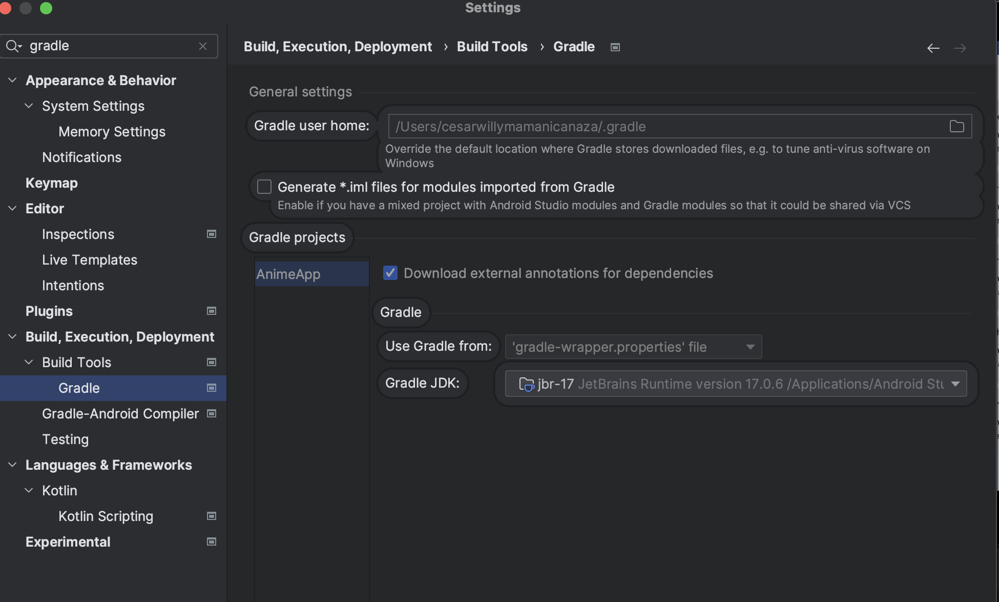

# APP MULTIPLATFORM ANDROID - IOS
## CREDENTIALS APP LOGIN
`  "email": "your_email@example.com"
   "password": "12345678" `
## CESAR CANAZA
Mobile developer willing to learn old and new technologies, I like the team work and communication.
Thank you for check this project.

## Kotlin Multiplatform Jetpack Compose

| Android                                                                                                                   | iOS                                                                                                               |
|---------------------------------------------------------------------------------------------------------------------------|-------------------------------------------------------------------------------------------------------------------|
| [](https://youtu.be/Zs0ULdlJ0OI) | [](https://youtu.be/B-Z1Gtk-y-8) |


## Module Architecture

* `/composeApp` is for code that will be shared across your Compose Multiplatform applications.
  It contains several subfolders:
  - `commonMain` is for code that’s common for all targets.
  - Other folders are for Kotlin code that will be compiled for only the platform indicated in the folder name.
    For example, if you want to use Apple’s CoreCrypto for the iOS part of your Kotlin app,
    `iosMain` would be the right folder for such calls.

* `/iosApp` contains iOS applications. Even if you’re sharing your UI with Compose Multiplatform, 
  you need this entry point for your iOS app. This is also where you should add SwiftUI code for your project.

- 


## Architecture MVVM with clean
### Framework
- Local:  Contains code for SQLdelight - Datastore
- Network:  Contains code like KTOR - GraphQL - Interceptors  and more.
  - graphQL
  - resApi
### data (Repositories)
- features: Contains all the content of each feature `For example: Auth` like `access to framework -> database or retrofit`
  - entities: Contains all the entities of the feature like `Auth`
  - mapper: this change objets  of Data to Domain and reverse.
  - remote: Contains the interface with all the requirements that need this feature of the framework 
  - repository files: Contains the implementation of the repository depending the business logic `AuthRepositoryImpl`.
### domain (Model - Use Case)
- base: It contains all the methods like baseUseCase, Extensions and more.
- repository: It contains all the interfaces with methods needed by the domain layer of the framework.
- usecase:
  - entities: Contains all the entities in domain with the logic if they have
  - usecase Files:  Contains each use case of the app where there are functionalities like sort, filter  and others
### presentation (ViewModel - Screen UI)
- composables: Contains all common composables.
- navigation: Contains the entire navigation hierarchy using DECOMPOSE
- screens:It is managed by each feature that will contain the viewModel and the composable screen.
- theme:  Configurations like Dimension, Color, Font, Theme.
- utils: Contains extension function and shared code and expect Classes
- validations: Contains logic of validations for TextFields
- App: Contains the main composable with the configurations for the navigation components.
### Additional comments
- di: It contains the dependency injection library in this case Koin with all the configuration.
- util: Contains global Constants and Extension Functions

## Technology Stack
### Common Main (Shared Code)
- Kotlin Multiplatform: A programming language that supports multiplatform development.
- Kotlin Coroutines: Provides a way to manage threads easily.
- Flow: A library for managing asynchronous streams of data.
- MVVM: Architecture design that helps decouple code into layers.
- Decompose: Library for simplifying and streamlining navigation between composables or screens.
- Koin: Dependency injection at runtime.
- Ktor: Library for consuming RESTful APIs.
- GraphQL: A query language for your API.
- Kamel Image: Image processing library.
- Apollo Cache and Runtime: Libraries for working with GraphQL.
- Date/Time Library: A library for handling date and time operations.
- Android DataStore: Android's modern data storage solution.
- Essenty Parcelable: Library for simplifying Parcelable implementation.
- Serialization (Kotlinx): Serialization library for Kotlin.
### Android Main
- Jetpack Compose: UI framework for Android using Kotlin.
- Compose UI, Tooling, and Activity: Compose UI components and activity integration.
- Koin Androidx Compose: Koin integration for Android.
- Ktor Client Android: Ktor HTTP client for Android.
- Lottie: Animation library for Android.
### iOS Main
- Ktor Client Darwin: Ktor HTTP client for iOS.
- Decompose: Navigation library for iOS. 
- Moko Resources and Graphics: Resources and graphics handling for iOS. 
- Parcelize Darwin Runtime: Library for Parcelable implementation on iOS.
## Configuration:
### Local.properties
Add  this line
```
SHARED_PREFERENCES_NAME=DB
BASE_URL=https://survey-api.nimblehq.co/
BASE_URL_GQL=https://survey-api.nimblehq.co/graphql
CLIENT_SECRET=clientSecret that you provide me
CLIENT_ID=clientID that you provide me
DEBUG_KEY_PASSWORD=holacomoestas
```
**If you want the client secret and the client ID send me a message by linkedin.** 
### Gradle Java

Go to **Gradle JDK** and change to **Java17**



### DOWNLOAD APP
## Download the app by Google Drive
- [GOOGLE DRIVE](https://drive.google.com/drive/folders/1_hQUdqUJ88wDag87t5jfIcgUmh4aFTGI?usp=sharing)
## Download the app by artifact github
Go to [Here](https://github.com/cesarwillymc/KMPLogin/actions)
-   
  Later select the first workflow and download the apk
- 

Learn more about [Kotlin Multiplatform](https://www.jetbrains.com/help/kotlin-multiplatform-dev/get-started.html)…